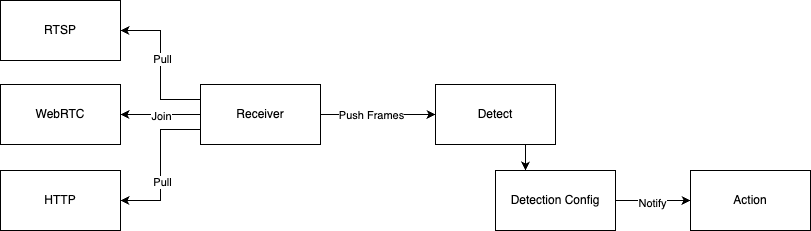

# cvkit.io server

A worker for performing computer vision related operations and generating events optimized to run as a container

## Components



## Installation

`python -m venv .venv`

`source .venv/bin/activate`

`pip install -r requirements.txt`  


## How it works

The server will need a config file that defines

```json
{
    "receiver":{
        "type" : "rtsp|webrtc|http",
        "source" : "http://server/somefile.mp4"
    },
    "detect":[
        {
            "type" : "humanoid",
            "variant" : "yolo",
            "frequency_ms" : 500,
            "actions" : [
                {
                    "type" : "sms",
                    "destination" : "+1234567890"
                },
                {
                    "type" : "email",
                    "destination" : "email@example.com"
                }
            ]
        }
    ]


```

## Initial test scenarios

1. Detect a humanoid and send an email
