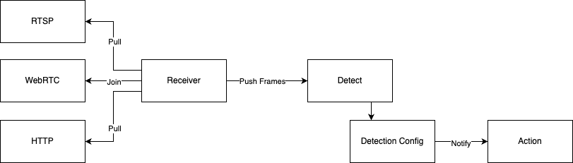

# cvkit.io worker

A worker as part of the cvkit.io platform for performing real time computer vision related operations and generating events optimized to run as a container.

One of the key considerations for this package is that it can manage complex chains of computer vision tasks in real time without blocking the main frame processing loop. 

Computer vision tasks are both highly compute (CPU and GPU) intensive and can take time to perform. In a real time environment it is critical that these
don't block the main process and can be distrbuted across CPUs and GPUs on a single machine or across nodes in a cluster.

Some examples:

1. Are there faces in the frame?
    --> Yes, extract the faces
        --> Is the face live?
            --> For each face does it match an entry in a face DB
                --> If we get a match send a notification

2. Are there cars in the frame?
    --> Yes, extract the cars
        --> Extract the car features
            --> Does the car have a numberplate?
                --> If the number plate matches a DB entry send a notification

3. Was there a scene change?
    --> Yes, was there a humanoid in it?
        --> Yes, was it Bob?
            --> No
                --> Grab a frame and send it for understanding
                  --> Send an alert with a description of the frame         

## Components



## Installation

### Development Installation

```bash
# Create and activate virtual environment
python -m venv .venv
source .venv/bin/activate  # On Windows: .venv\Scripts\activate

# Install package in development mode
pip install -e .
```

### Production Installation

```bash
pip install cvkitworker
```

### CI/CD Status

⚠️ **Note**: GitHub Actions CI tests are currently failing due to timeout issues with dlib compilation. The tests pass locally but timeout in CI due to the long compilation time of dlib from source.

## Usage

After installation, you can run the application in several ways:

```bash
# Using the installed CLI command
cvkitworker --config config.sample.json

# Or as a Python module
python -m cvkitworker --config config.sample.json
```

## Development Roadmap

This project is being incrementally improved with features from the `feature/improve-structure` branch. The implementation plan prioritizes testing infrastructure first, followed by reliability improvements.

### Implementation Notes

- Each phase will be implemented incrementally with thorough testing
- Testing infrastructure (Phase 1) provides foundation for validating all subsequent changes
- Error handling improvements (Phase 2) are critical for production deployment
- CLI enhancements (Phase 3) improve developer productivity
- Later phases focus on flexibility and maintainability

### Current Status
- ✅ Package restructure complete (can run with `python -m cvkitio_worker`)
- 🔄 Ready to begin Phase 1: Testing Infrastructure

## How it works

The server will need a config file that defines

```json
{
    "receiver":{
        "type" : "rtsp|webrtc|http",
        "source" : "http://server/somefile.mp4"
    },
    "detectors":[
        {
            "type" : "humanoid",
            "variant" : "yolo",
            "frequency_ms" : 500,
            "actions" : [
                {
                    "type" : "sms",
                    "destination" : "+1234567890"
                },
                {
                    "type" : "email",
                    "destination" : "email@example.com"
                }
            ]
        }
    ]


```

## Initial test scenarios

1. Detect a humanoid and send an email
